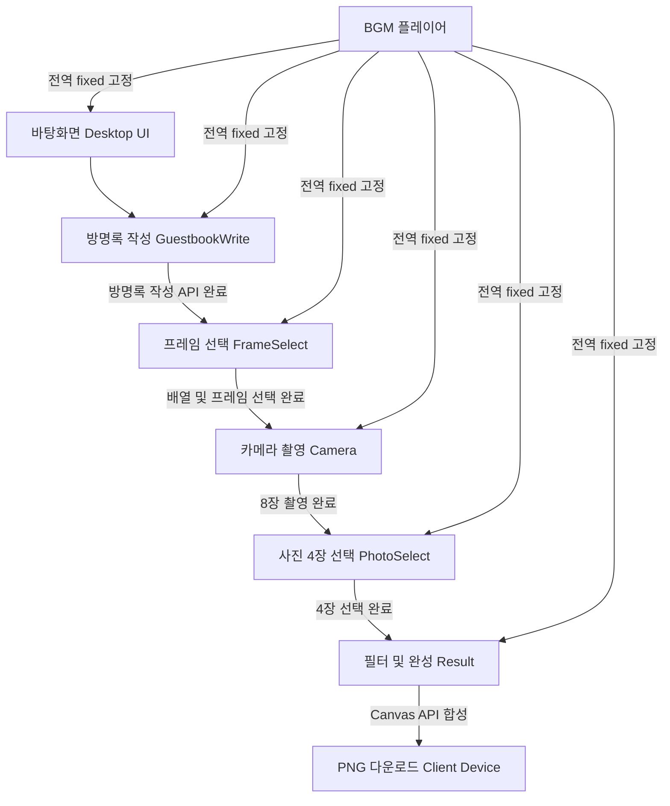

# 💾 자리네컷 (ZARINAECUT) - Project Status & Architecture Log

앉은 자리에서 찍는 레트로 윈도우98 / Y2K 컨셉의 인생네컷 포토부스 웹 서비스 **자리네컷**의 전체 아키텍처, 기능 정의, 그리고 작업 및 수정사항을 기록하는 로그 문서입니다.

---

## 🏗️ 전체 아키텍처 & 시스템 구조

### 1. 서비스 컨셉 & 흐름
자리네컷은 **비로그인**, **사진 서버 미저장**, **방명록 서버 저장**을 핵심 원칙으로 하는 웹 애플리케이션입니다.



### 2. 기술 스택 (Tech Stack)
*   **Frontend**: Next.js 14+ (App Router), TypeScript, Tailwind CSS
*   **State Management**: Zustand (화면 흐름 및 BGM 전역 상태 제어)
*   **APIs**: Next.js API Routes (`/api/guestbook`)
*   **Database**: PostgreSQL (Supabase) - 방명록 텍스트 데이터만 저장 (사진 저장 안 함)
*   **Web APIs**:
    *   `MediaDevices.getUserMedia()`: 카메라 웹캠 연동
    *   `HTML5 Canvas API`: 클라이언트 사이드 이미지 합성 및 필터
    *   `Web Audio API`: 찰칵 셔터 사운드 생성
    *   `HTML5 Audio`: 전역 BGM 재생

### 3. 디렉토리 구조 (Folder Structure)
```text
zarinaecut/
├── app/
│   ├── layout.tsx              # 루트 레이아웃 (BGM 및 전역 컨텍스트)
│   ├── page.tsx                # 바탕화면 진입점 (단일 페이지 내 창 레이어링)
│   └── api/
│       └── guestbook/
│           └── route.ts        # GET/POST 방명록 API
├── components/
│   ├── desktop/
│   │   ├── Desktop.tsx         # 바탕화면 컨테이너 (청록색 배경)
│   │   ├── DesktopIcon.tsx     # 더블클릭 실행 가능한 바탕화면 아이콘
│   │   ├── Taskbar.tsx         # 하단 태스크바 (시작 버튼, 시계, 창 탭)
│   │   └── StartMenu.tsx       # 시작 메뉴 팝업
│   ├── windows/
│   │   ├── Win98Window.tsx     # 윈도우98 스타일 공통 창 래퍼 (드래그 가능)
│   │   ├── GuestbookList.tsx   # 방명록 목록 창
│   │   ├── GuestbookWrite.tsx  # 방명록 작성 창
│   │   ├── FrameSelect.tsx     # 프레임 선택 창
│   │   ├── Camera.tsx          # 촬영 창 (카메라 뷰 + 카운트다운)
│   │   ├── PhotoSelect.tsx     # 사진 4장 선택 창
│   │   └── Result.tsx          # 필터 선택 + 완성본 미리보기 + 저장
│   ├── bgm/
│   │   └── BgmPlayer.tsx       # 우측 하단 고정 BGM 플레이어
│   └── ui/
│       └── Win98Button.tsx     # 레트로 윈도우 버튼
├── hooks/
│   ├── useCamera.ts            # 카메라 스트림 및 촬영 제어 훅
│   └── useBgm.ts               # BGM 재생 및 싱크 훅
├── store/
│   ├── bgmStore.ts             # BGM 상태 관리 (재생, 트랙, 볼륨 등)
│   └── flowStore.ts            # 화면 단계 및 창 오픈 상태 관리
├── utils/
│   ├── canvasCompose.ts        # Canvas 이미지 합성 엔진
│   └── filters.ts              # 흑백 및 뽀샤시 이미지 필터
└── public/
    ├── bgm/                    # 6곡의 레트로 BGM mp3 파일
    └── frames/                 # 프레임 디자인 리소스 (PNG, JSON 좌표)
```

---

## 🛠️ 핵심 기능 명세

### 1. 바탕화면 & 테스크바 (Desktop & Taskbar)
*   **Retro UI**: 청록색 `#008080` 배경, 윈도우98 스타일 아이콘.
*   **아이콘**: 더블클릭 시 해당 프로그램 창 오픈.
    *   `자리네컷` ➡️ 방명록 작성창 (`write`)
    *   `방명록` ➡️ 방명록 목록창 (`guestbook`)
    *   `내 사진첩` ➡️ 경고 팝업 ("여기에는 저장되지 않아요!")
    *   `내 PC` ➡️ 로컬 저장소 안내 창
    *   `휴지통` ➡️ 빈 휴지통 창
*   **Taskbar & StartMenu**: 활성화된 창 탭 표시, 디지털 시계 실시간 연동, 시작 메뉴 팝업 작동.
*   **BGM 플레이어**: 우측 하단 고정, 트랙 재생/일시정지/이전/다음 기능, 접기/펼치기 및 마퀴 애니메이션 지원.

### 2. 방명록 시스템 (Guestbook)
*   **작성 (GuestbookWrite)**: 닉네임은 '익명의 포토쟁이' 고정. 응원 메시지(최대 200자) 입력 후 완료 시 API 호출. 성공하면 프레임 선택 단계로 자동 이동.
*   **목록 (GuestbookList)**: 메모장(`방명록.txt`) 컨셉 UI. 최신 방명록 데이터 무한 스크롤 또는 페이징 열람. 상단 티커 마퀴 작동.

### 3. 촬영 및 합성 Flow (Photo Booth Flow)
1.  **프레임 선택 (FrameSelect)**: 2x2 또는 1x4 레이아웃 중 선택 후 프레임 스킨 디자인 선택.
2.  **카메라 촬영 (Camera)**: `getUserMedia` 웹캠 스트림 실행. 촬영 클릭 시 3! 2! 1! 카운트다운 진행 후 찰칵 사운드(Web Audio API)와 함께 플래시 효과. 총 8장 순차 촬영 및 임시 dataURL 저장.
3.  **사진 선택 (PhotoSelect)**: 촬영된 8장 중 마음에 드는 4장을 배치 순서대로 선택 (선택 번호 1~4 뱃지 표시).
4.  **필터 및 합성 (Result)**: 4장 사진에 필터(원본, 흑백, 뽀샤시) 선택적 적용. Canvas API로 [배경 그라디언트 ➡️ 사진 4장 ➡️ 프레임 PNG 오버레이 ➡️ 로고 텍스트] 순서로 합성.
5.  **저장**: `canvas.toBlob()`을 활용해 로컬 디바이스에 PNG 파일 다운로드. (서버에 사진 전송 원천 차단)

---

## 📝 수정사항 및 개발 로그 (Changelog)

이 프로젝트의 구현 진행 상황과 변경/수정 사항을 이곳에 주기적으로 기록합니다.

| 일자 | 작업 내용 | 상세 및 비고 | 진행 상황 |
| :--- | :--- | :--- | :---: |
| 2026-06-16 | 요구사항 분석 및 아키텍처 문서 정의 | `자리네컷_요구사항분석서.docx`, `자리네컷_프론트엔드_기능정의서.docx` 파싱 완료 및 `PROJECT_STATUS.md` 생성 | **[완료]** |
| 2026-06-16 | 프로젝트 초기 설정 및 스켈레톤 구축 | Next.js 프로젝트 생성 및 Zustand, Tailwind CSS 세팅 완료 | **[완료]** |
| 2026-06-16 | 핵심 기능 및 Retro UI 컴포넌트 구현 | 공통 Window/Button, Desktop, Taskbar, Guestbook, Camera/useCamera, PhotoSelect, Result/canvasCompose, BGM 플레이어 구현 완료 | **[완료]** |
| 2026-06-16 | 빌드 및 품질 검증 | npm run build를 통한 TypeScript 및 Next.js 빌드 성공 확인 | **[완료]** |
| 2026-06-16 | 바탕화면 포인터 이벤트 버그 수정 | 윈도우 창 영역의 포인터 락 문제 해결 (바탕화면 아이콘 더블클릭 오작동 버그 픽스) | **[완료]** |
| 2026-06-16 | TiDB 연동 | `mysql2` 드라이버 설치, `src/lib/db.ts` 커넥션 풀 생성, `/api/guestbook` route를 인메모리 → 실제 TiDB 쿼리로 교체, DB명 `zari` / 닉네임 `익명의 방문자` 반영 | **[완료]** |

---

> [!IMPORTANT]
> **사진 보안 원칙**: 사용자가 찍은 사진 데이터는 어떠한 형태로도 백엔드 서버나 외부 DB에 전송되어서는 안 됩니다. 모든 합성 및 저장 작업은 클라이언트의 브라우저 단에서 완결되도록 안전하게 구현해야 합니다.
